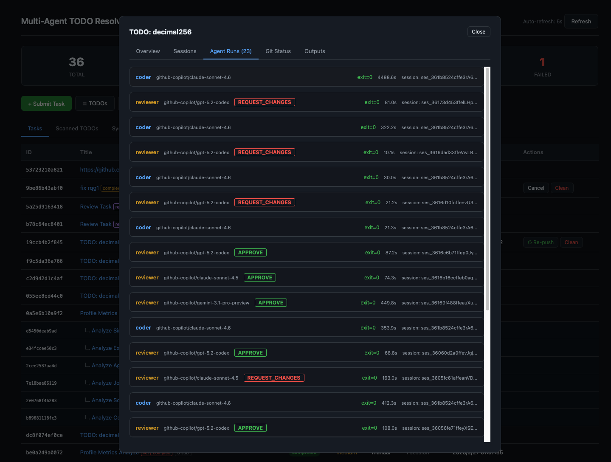
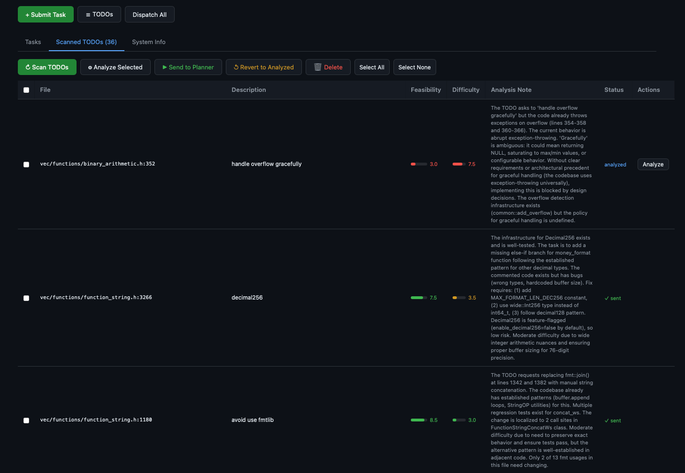

# Multi-Agent TODO Resolver

A persistent, daemon-based multi-agent system that leverages [opencode](https://github.com/nicepkg/opencode) to **automatically discover, plan, implement, and review code changes** across a codebase. Multiple tasks run in parallel, each in its own `git worktree`, driven by a **Planner → Coder → Reviewer** pipeline with configurable models and retry logic.

## Key Features

- **Automatic TODO Discovery** — Scans a repository for `TODO`/`FIXME` comments, then uses an AI analyzer to score each by feasibility and difficulty, producing a prioritized backlog.
- **Plan → Code → Review Loop** — Each task goes through a planner (generates an implementation plan), a coder (writes code in an isolated worktree), and one or more reviewers (approve or request changes). Rejected code re-enters the loop automatically.
- **Multi-Model, Multi-Reviewer** — Assign different models by task complexity (e.g. Opus for hard tasks, Haiku for simple ones). Multiple reviewer models vote; **all** must approve for a task to pass.
- **Parallel Execution** — Tasks run concurrently in separate `git worktree` branches, up to a configurable limit.
- **Human-in-the-Loop** — Completed or failed tasks can be *revised* with manual feedback, re-entering the code→review loop. A dedicated *review-only* mode lets you submit patches or PRs for AI review without any code generation.
- **Web Dashboard** — Real-time dark-themed UI for task management, agent run inspection, TODO browsing, model configuration, and branch publishing.
- **Runtime Model Editing** — Change planner/coder/reviewer models from the dashboard at any time; changes persist to `config.yaml`.
- **Resource Lifecycle** — Worktrees and branches are automatically cleaned up when review-only tasks complete, tasks are cancelled, or via a manual "Clean" action.

## Screenshots

### Agent Runs — Code → Review Loop

Each task cycles through coder and reviewer agents. Reviewer verdicts (**APPROVE** / **REQUEST_CHANGES**) are displayed inline. The coder retries with the reviewer's feedback until all reviewers approve or retries are exhausted.



### Scanned TODOs — AI-Analyzed Backlog

TODOs are scanned from the repo, then analyzed by an AI model that scores **feasibility** and **difficulty**, and writes a detailed analysis note. You can selectively dispatch them as tasks.



## Architecture

```
                         ┌──────────────────────────────────┐
                         │          Web Dashboard           │
                         │  (FastAPI, single-file HTML/JS)  │
                         └──────────┬───────────────────────┘
                                    │ REST API
                                    ▼
┌───────────────────────────────────────────────────────────────────┐
│                          Orchestrator                             │
│                                                                   │
│  Task Queue (SQLite)  ·  Parallel Dispatch  ·  Retry Logic        │
│  TODO Scanning        ·  Worktree Lifecycle  ·  Model Config      │
└──────┬──────────────────────┬──────────────────────┬──────────────┘
       │                      │                      │
       ▼                      ▼                      ▼
┌─────────────┐     ┌─────────────┐     ┌──────────────────────┐
│   Planner   │     │    Coder    │     │  Reviewer(s)         │
│   Agent     │     │    Agent    │     │  (N models, all must │
│             │     │  (per-      │     │   approve)           │
│ complexity  │     │  complexity)│     └──────────────────────┘
│ assessment  │     │             │
│ + sub-task  │     │ git worktree│
│   splitting │     │ isolation   │
└─────────────┘     └─────────────┘
       │                   │                    │
       └───────────────────┴────────────────────┘
                           │
                    opencode CLI
                  (any LLM backend)
```

## Task Pipeline

```
User submits task / TODO dispatched
        │
        ▼
   ┌─────────┐   Assesses complexity, may split into sub-tasks
   │ PLANNING │──────────────────────────────────────────────┐
   └────┬────┘                                               │
        │                                           sub-tasks dispatched
        ▼                                           independently
   git worktree created (agent/task-<id>-<slug>)
        │
        ▼  ◄─── retry loop (up to max_retries) ───┐
   ┌─────────┐                                     │
   │ CODING  │  Coder implements in worktree       │
   └────┬────┘                                     │
        │                                          │
        ▼                                          │
   ┌──────────┐                                    │
   │ REVIEWING│  All reviewers vote                │
   └────┬─────┘                                    │
        │                                          │
        ├── All APPROVE ──▶ COMPLETED              │
        │                                          │
        └── Any REQUEST_CHANGES ───────────────────┘
                                    (feedback fed back to coder)
            After max retries ──▶ FAILED
```

Completed tasks can be **published** (push branch to remote), **revised** (human sends feedback, loop resumes), or **cleaned** (worktree + branch deleted).

## Quick Start

### Prerequisites

- Python 3.11+
- [opencode](https://github.com/nicepkg/opencode) CLI installed and configured with at least one model provider
- A git repository to work on

### Setup

```bash
# Clone this project
git clone <repo-url> multi-agent-todo
cd multi-agent-todo

# Install dependencies
pip install -r requirements.txt

# Copy and edit config
cp config.yaml.template config.yaml
# Edit config.yaml — set repo.path, model names, etc.

# Start the daemon
python cli.py start

# Open the dashboard
# http://localhost:8778
```

## CLI Reference

```bash
# Daemon
python cli.py start [--foreground]          # Start daemon (background or foreground)
python cli.py stop                          # Stop daemon
python cli.py status                        # Show system status

# Tasks
python cli.py add -t "Fix bug X" -d "..."  # Submit a task
python cli.py list [--status pending]       # List tasks
python cli.py show <task_id> [--json]       # Show task details
python cli.py dispatch <task_id|all>        # Dispatch pending task(s)
python cli.py cancel <task_id>              # Cancel a running task

# TODO Management
python cli.py scan [--limit 50]             # Scan repo for TODO/FIXME comments
python cli.py todos list                    # List scanned items with scores
python cli.py todos analyze [id ...]        # AI-analyze feasibility & difficulty
python cli.py todos dispatch id1 id2 ...    # Send to planner as tasks
python cli.py todos delete id1 id2 ...      # Remove TODO items

# Testing
python cli.py run-one -t "Title" -d "..."   # Run one task synchronously
```

## Web Dashboard

Access at `http://<host>:<port>` (default `http://localhost:8778`). Three main tabs:

| Tab | Features |
|---|---|
| **Tasks** | Task list with status badges, complexity indicators, sub-task hierarchy. Inline actions: Run, Publish, Cancel, Clean. Click a task for the detail modal with tabs for Overview, Sessions, Agent Runs, Git Status, and Outputs. |
| **Scanned TODOs** | Browse scanned TODO items. Bulk actions: Scan, Analyze, Send to Planner, Revert, Delete. Each item shows file location, description, feasibility/difficulty scores, and AI analysis notes. |
| **System Info** | Live view of orchestrator config. Edit planner/coder/reviewer models via dropdowns (populated from `opencode models`). Changes persist to `config.yaml` immediately. |

## Configuration

See [`config.yaml.template`](config.yaml.template) for a full annotated template. Key sections:

| Section | Purpose |
|---|---|
| `repo` | Target repository path, base branch, worktree directory, setup hook scripts |
| `opencode` | Model assignments (planner, coder by complexity, reviewers), timeout |
| `orchestrator` | Max parallel tasks, retry count, poll interval, auto-scan toggle |
| `web` | Dashboard host and port |
| `publish` | Git remote for pushing completed branches |
| `hook_env` | Environment variables injected into worktree hook scripts |

## Project Structure

```
multi-agent-todo/
├── cli.py                  # CLI entry point (argparse)
├── daemon.py               # Background daemon with signal handling
├── config.yaml             # User configuration (git-ignored)
├── config.yaml.template    # Annotated config template
├── requirements.txt        # Python dependencies
├── core/
│   ├── config.py           # Config loading with deep merge
│   ├── models.py           # Dataclasses: Task, AgentRun, TodoItem
│   ├── database.py         # SQLite persistence layer
│   ├── worktree.py         # Git worktree create/remove/publish/hooks
│   ├── opencode_client.py  # opencode CLI wrapper with auto-continue
│   └── orchestrator.py     # Central orchestrator: dispatch, lifecycle, cleanup
├── agents/
│   ├── base.py             # BaseAgent (opencode invocation)
│   ├── prompts.py          # All prompt templates (tune agent behavior here)
│   ├── planner.py          # PlannerAgent: plan tasks, analyze TODOs
│   ├── coder.py            # CoderAgent: implement & retry with feedback
│   └── reviewer.py         # ReviewerAgent: review diffs & patches
├── web/
│   └── app.py              # FastAPI app + embedded HTML/JS dashboard
├── docs/                   # Screenshots and documentation assets
├── data/                   # SQLite DB, PID file (auto-created)
├── logs/                   # Timestamped log files (auto-created)
└── worktrees/              # Git worktrees (auto-created, auto-cleaned)
```

## Adapting to Another Repository

The system is **repository-agnostic**. To point it at a different codebase:

1. Set `repo.path` to the target repo's absolute path.
2. Set `repo.base_branch` to the branch worktrees should be based on.
3. Optionally configure `repo.worktree_hooks` to run setup scripts (e.g. build `compile_commands.json`, install deps) in each new worktree.

No changes to agent code are needed — `opencode` provides the codebase understanding.
